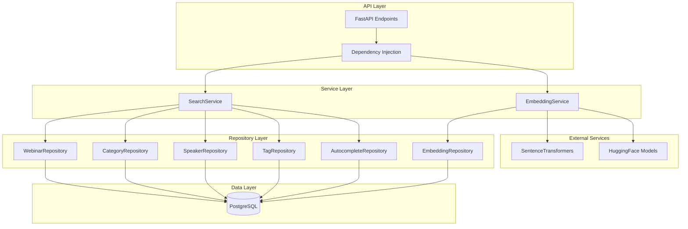
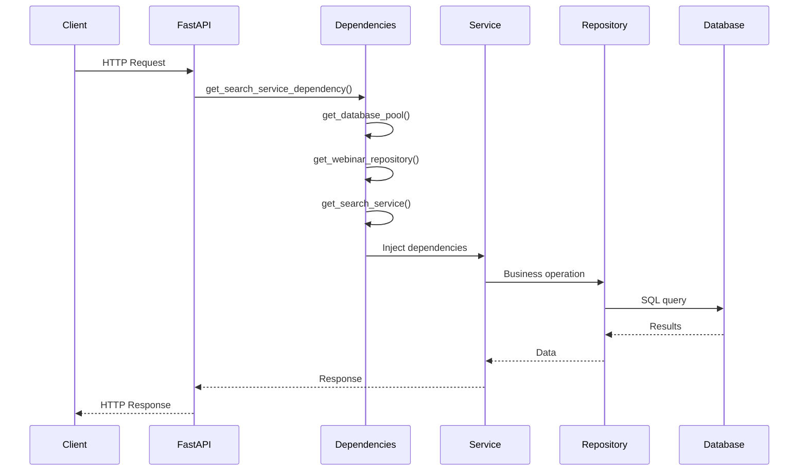
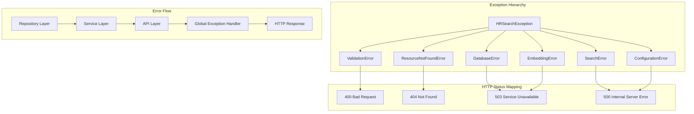
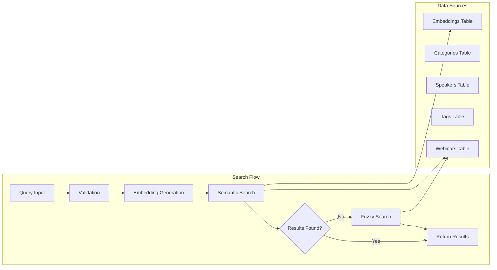

# HR Search - Refactored Architecture

## 🏗️ **Clean Architecture Implementation**

### **Core Application Structure** (`backend/app/`)

```
app/
├── main.py                    # FastAPI application with DI
├── config.py                  # Pydantic configuration management
├── dependencies.py            # Dependency injection container
├── exceptions.py              # Custom exception hierarchy
├── logging_config.py          # Structured logging configuration
│
├── repositories/              # Data Access Layer
│   ├── __init__.py
│   ├── webinar.py            # WebinarRepository
│   ├── category.py           # Category/Speaker/Tag/Autocomplete repos
│   └── embedding.py          # EmbeddingRepository
│
└── services/                  # Business Logic Layer
    ├── __init__.py
    ├── search_service.py     # SearchService (business logic)
    └── embedding_service.py  # EmbeddingService (ML operations)
```

## 🔄 **Architecture Flow Diagram**



## 🎯 **Dependency Injection Flow**



## 🛡️ **Error Handling Architecture**



## 📊 **Data Flow Architecture**



## 🧪 **Testing Architecture**

```
tests/
├── unit/                      # Unit Tests
│   ├── test_embedding_service.py
│   └── test_search_service.py
│
├── integration/               # Integration Tests
│   ├── conftest.py
│   └── test_search_flow.py
│
└── conftest.py               # Shared fixtures
```

## 📚 **Documentation Structure**

```
docs/
├── 04_implementation/
│   └── api_documentation.md       # API documentation
└── glossary.md                     # Technical and HR terms
```

## 🚀 **Quick Commands**

```bash
# Development Setup
cd backend
python -m venv .venv
.venv\Scripts\activate  # Windows
pip install -r requirements.txt
pip install -r requirements-dev.txt

# Database Setup
python scripts/setup/init.sql
python scripts/data/generate_sample.py
python scripts/maintenance/generate_embeddings.py

# Testing
python -m pytest tests/unit/ -v
python -m pytest tests/integration/ -v
python -m pytest tests/performance/ -v

# Code Quality
python -m flake8 app/ --count --statistics
python -m black app/ --line-length 88

# Run Application
python -m app.main
```

## ✅ **Architecture Benefits**

### **SOLID Principles**
- **S**ingle Responsibility: Each layer has a clear purpose
- **O**pen/Closed: Easy to extend without modifying existing code
- **L**iskov Substitution: Repository interfaces are interchangeable
- **I**nterface Segregation: Focused, minimal interfaces
- **D**ependency Inversion: Depend on abstractions, not concretions

### **Clean Architecture**
- **Separation of Concerns**: Clear boundaries between layers
- **Dependency Injection**: Testable, maintainable code
- **Error Handling**: Consistent, traceable error management
- **Configuration**: Centralized, type-safe settings
- **Logging**: Structured, contextual logging

### **Maintainability**
- **Testable**: Each layer can be tested in isolation
- **Extensible**: Easy to add new features
- **Debuggable**: Clear error flow and logging
- **Documented**: Comprehensive documentation
- **Consistent**: Standardized patterns throughout

## 🔧 **Key Design Patterns**

1. **Repository Pattern**: Data access abstraction
2. **Service Layer Pattern**: Business logic encapsulation
3. **Dependency Injection**: Inversion of control
4. **Factory Pattern**: Object creation management
5. **Strategy Pattern**: Search algorithm selection
6. **Observer Pattern**: Logging and monitoring
7. **Singleton Pattern**: Configuration management (where appropriate)

This architecture provides a solid foundation for enterprise-grade applications with proper separation of concerns, testability, and maintainability.