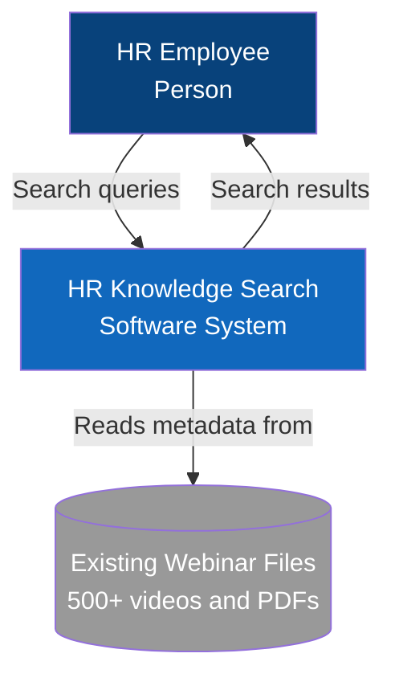
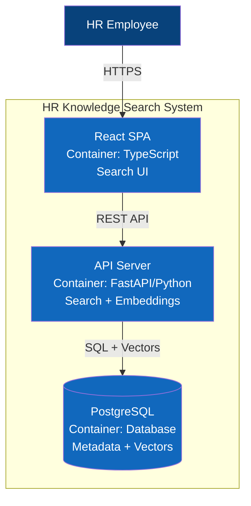
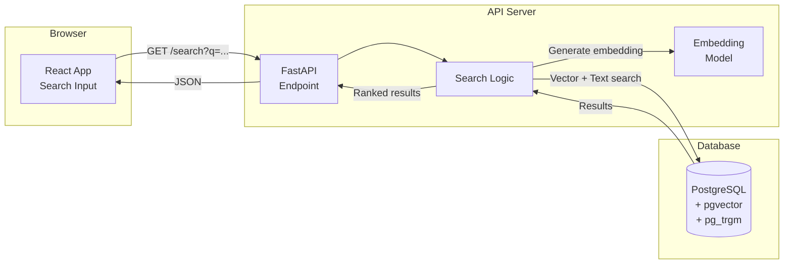
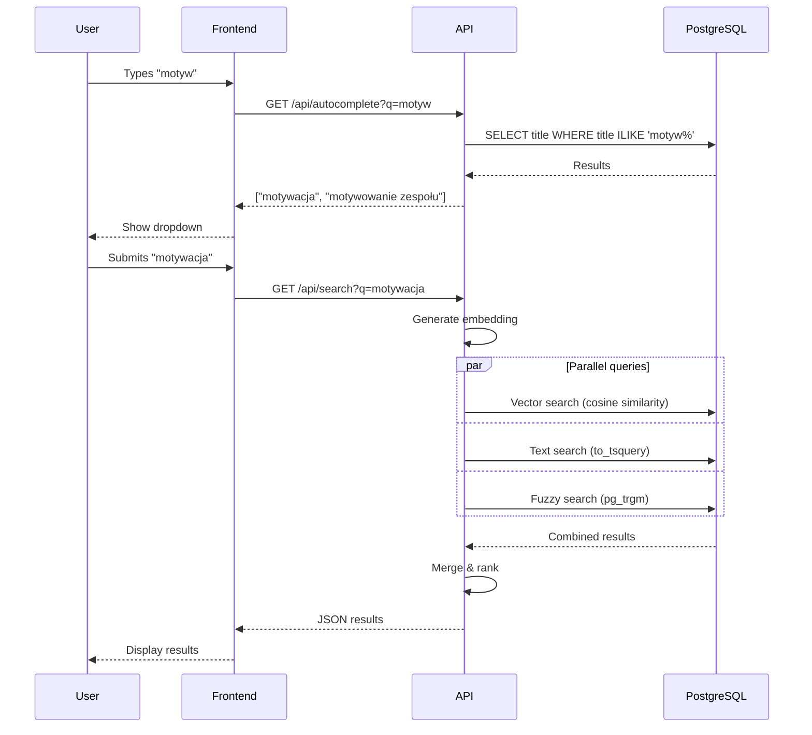
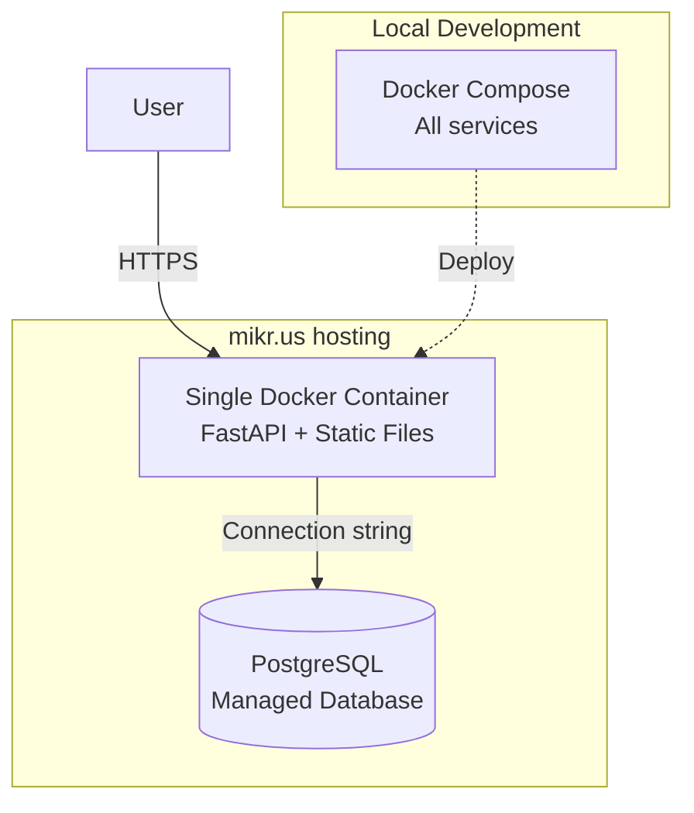

# System Architecture

## C4 Level 1: System Context

## C4 Level 2: Container Diagram

## Search Flow

## Search Request Sequence

## Component Details

### Frontend (React SPA)
- **Framework**: React 18 + TypeScript + Vite
- **HTTP Client**: Native fetch API (no axios needed)
- **Styling**: Tailwind CSS
- **No unnecessary libs** - keep it simple

### Backend (FastAPI)
- **Framework**: FastAPI
- **Model**: paraphrase-multilingual-MiniLM-L12-v2 (Polish + English)
- **Dependencies**:
  - sentence-transformers (embeddings)
  - asyncpg (PostgreSQL driver)
  - python-dotenv (config)

### Database (PostgreSQL)
- **Version**: PostgreSQL 15+
- **Extensions**: 
  - pgvector - vector similarity
  - pg_trgm - fuzzy matching
  - unaccent - Polish characters normalization
- **Indexes**:
  - HNSW on vectors
  - GIN on tsvector
  - text_pattern_ops on title

## Deployment

### Deployment Strategy
- **Development**: Docker Compose locally
- **Production**: Single container on mikr.us
  - Frontend: Built static files served by FastAPI
  - Backend: Same FastAPI instance
  - Database: Managed PostgreSQL from mikr.us
  - URL: https://hr-search.mikr.us

### Simplified Architecture Benefits
- One container to deploy (easier)
- No CORS issues (same origin)
- No separate hosting for frontend
- Minimal configuration

## Performance Targets

| Metric | Target | Why |
|--------|--------|-----|
| Search response | < 300ms | Acceptable for users |
| Autocomplete | < 100ms | Fast enough to feel instant |
| Concurrent users | 10 | Realistic for HR tool |
| Memory usage | < 512MB | Fits mikr.us free tier |

## Technology Decisions

### Why single container?
- Portfolio project - simplicity matters
- mikr.us has container limits
- No need for separate frontend hosting
- FastAPI can serve static files perfectly fine

### Why no React Query/Axios?
- Native fetch is enough for simple searches
- Less dependencies = smaller bundle
- Portfolio should show you can work without heavy libraries

### Why no rate limiting?
- Internal HR tool, not public API
- Adds complexity without real benefit
- Trust your users (it's an enterprise tool)

### What's NOT included (intentionally)
- Redis cache - PostgreSQL is fast enough for 1000 records
- Load balancer - single instance is fine
- Service mesh - overengineering
- API Gateway - FastAPI handles everything needed
