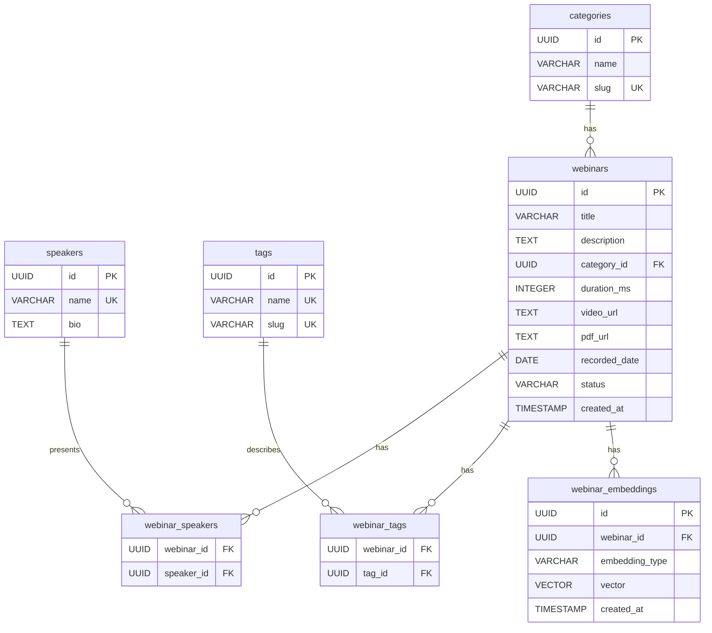
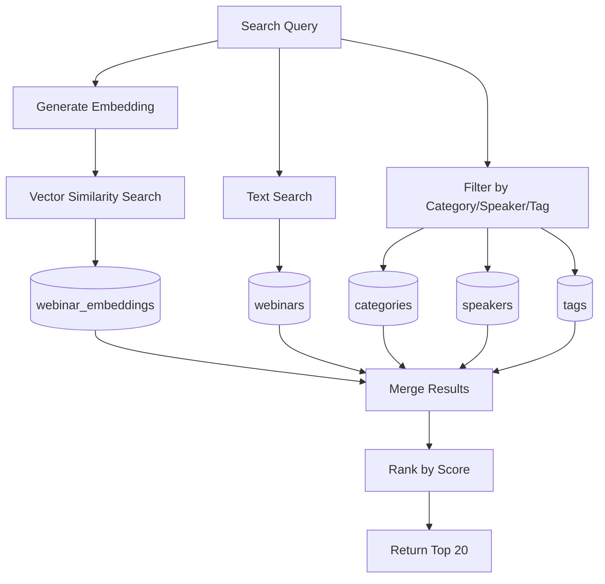
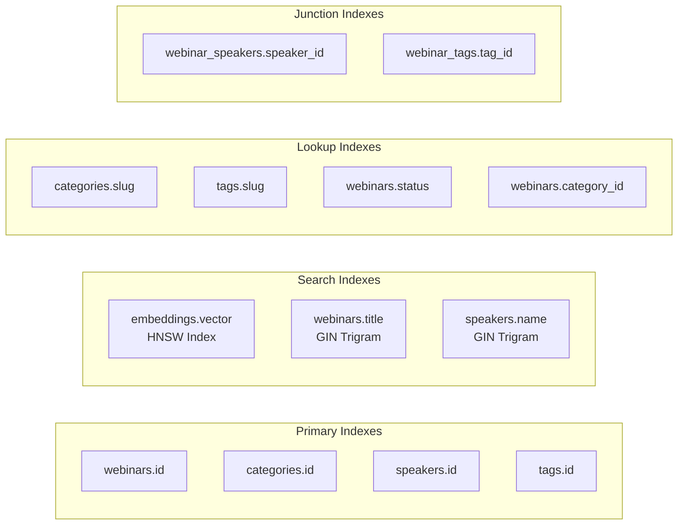
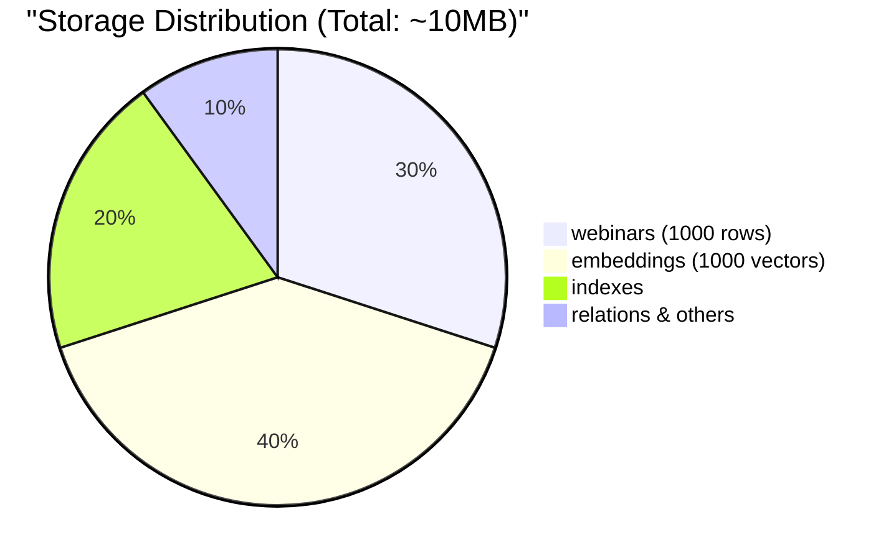

# Database Entity Relationship Diagram

## ERD Diagram

## Table Relationships

### One-to-Many
- **categories → webinars**: Each webinar belongs to one category
- **webinars → webinar_embeddings**: Each webinar can have multiple embedding types

### Many-to-Many (through junction tables)
- **webinars ↔ speakers**: Via `webinar_speakers`
- **webinars ↔ tags**: Via `webinar_tags`

## Data Flow for Search

## Index Strategy

## Query Patterns

| Query Type | Tables Used | Index Used |
|------------|------------|------------|
| Semantic Search | webinar_embeddings → webinars | HNSW on vector |
| Title Search | webinars | GIN trigram on title |
| By Speaker | webinar_speakers → speakers → webinars | speaker_id index |
| By Category | webinars | category_id index |
| By Tag | webinar_tags → tags → webinars | tag_id index |
| Autocomplete | webinars, speakers, tags | trigram indexes |

## Storage Estimates

## Notes
- All foreign keys have CASCADE DELETE for data integrity
- UNIQUE constraints prevent duplicate speakers and tags
- Trigram indexes enable fuzzy matching for Polish text
- HNSW index optimized for ~1000 vectors (m=16, ef_construction=64)
