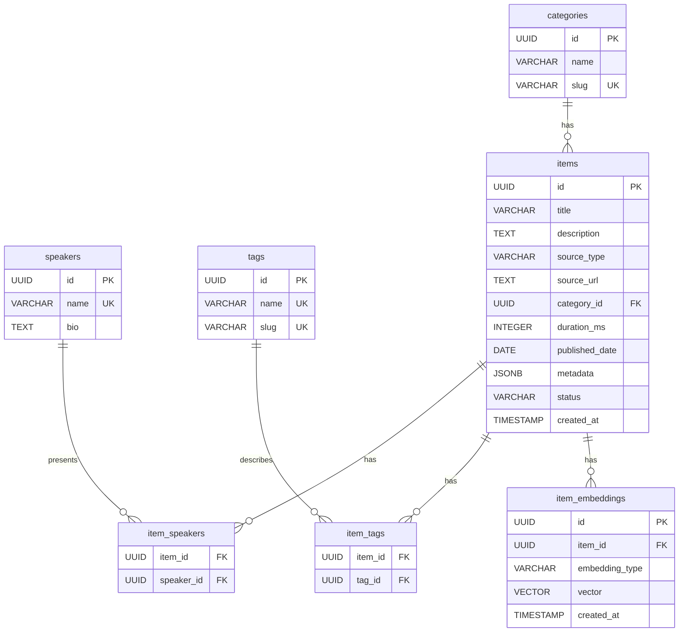
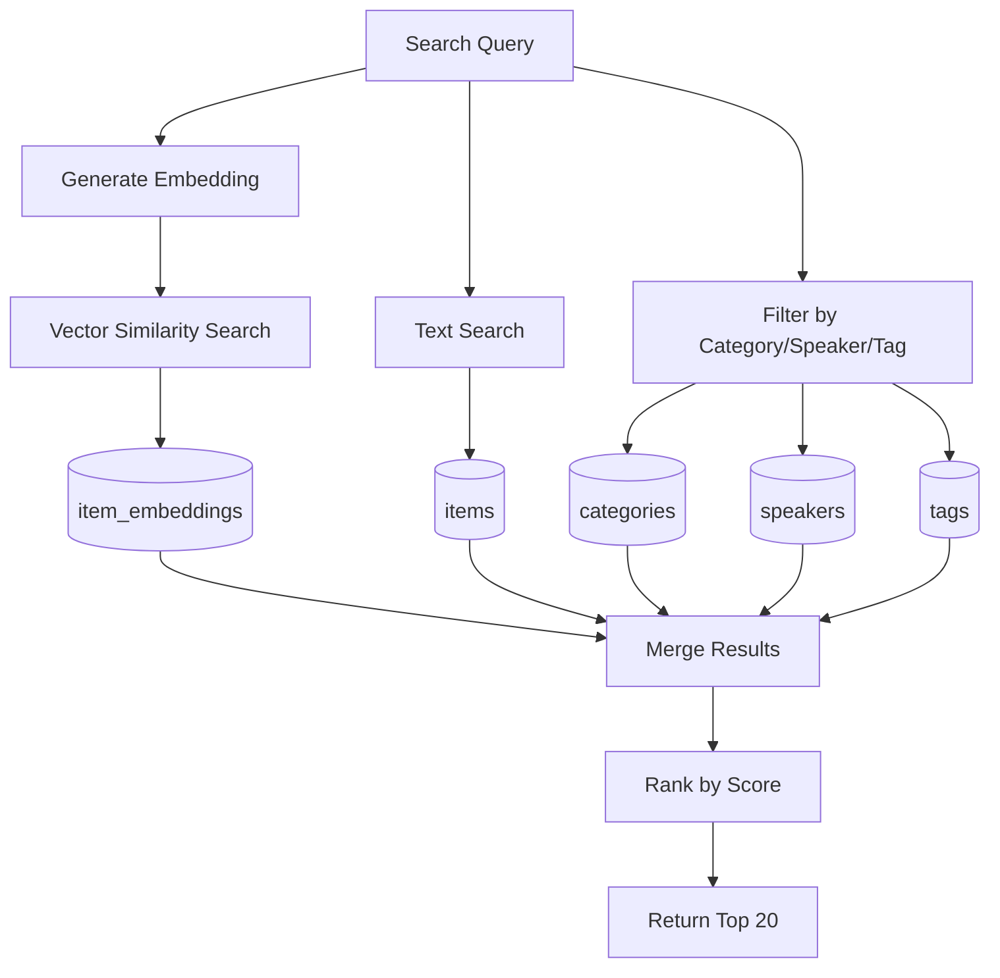
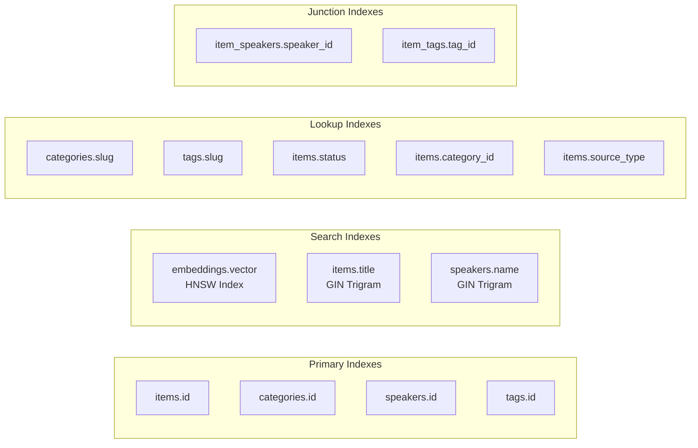
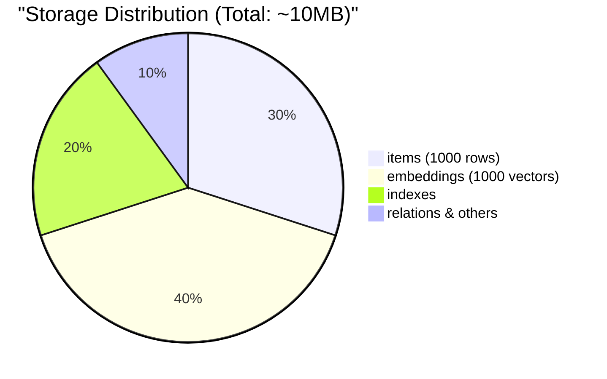

# Database Entity Relationship Diagram

## ERD Diagram

```mermaid
erDiagram
    categories {
        UUID id PK
        VARCHAR name
        VARCHAR slug UK
    }

    speakers {
        UUID id PK
        VARCHAR name UK
        TEXT bio
    }

    tags {
        UUID id PK
        VARCHAR name UK
        VARCHAR slug UK
    }

    items {
        UUID id PK
        VARCHAR title
        TEXT description
        VARCHAR source_type
        TEXT source_url
        UUID category_id FK
        INTEGER duration_ms
        DATE published_date
        JSONB metadata
        VARCHAR status
        TIMESTAMP created_at
    }

    item_speakers {
        UUID item_id FK
        UUID speaker_id FK
    }

    item_tags {
        UUID item_id FK
        UUID tag_id FK
    }

    item_embeddings {
        UUID id PK
        UUID item_id FK
        VARCHAR embedding_type
        VECTOR vector
        TIMESTAMP created_at
    }

    categories ||--o{ items : "has"
    items ||--o{ item_speakers : "has"
    speakers ||--o{ item_speakers : "presents"
    items ||--o{ item_tags : "has"
    tags ||--o{ item_tags : "describes"
    items ||--o{ item_embeddings : "has"
```

## Table Relationships

### One-to-Many
- **categories → items**: Each item belongs to one category
- **items → item_embeddings**: Each item can have multiple embedding types

### Many-to-Many (through junction tables)
- **items ↔ speakers**: Via `item_speakers`
- **items ↔ tags**: Via `item_tags`

## Data Flow for Search

```mermaid
flowchart TD
    Query[Search Query]
    Query --> Embedding[Generate Embedding]

    Embedding --> VectorSearch[Vector Similarity Search]
    VectorSearch --> Embeddings[(item_embeddings)]

    Query --> TextSearch[Text Search]
    TextSearch --> Items[(items)]

    Query --> FilterSearch[Filter by Category/Speaker/Tag]
    FilterSearch --> Categories[(categories)]
    FilterSearch --> Speakers[(speakers)]
    FilterSearch --> Tags[(tags)]

    Embeddings --> Results[Merge Results]
    Items --> Results
    Categories --> Results
    Speakers --> Results
    Tags --> Results

    Results --> Ranking[Rank by Score]
    Ranking --> Output[Return Top 20]
```

## Index Strategy

```mermaid
graph LR
    subgraph Primary Indexes
        PK1[items.id]
        PK2[categories.id]
        PK3[speakers.id]
        PK4[tags.id]
    end

    subgraph Search Indexes
        HNSW[embeddings.vector<br/>HNSW Index]
        TRGM1[items.title<br/>GIN Trigram]
        TRGM2[speakers.name<br/>GIN Trigram]
    end

    subgraph Lookup Indexes
        IDX1[categories.slug]
        IDX2[tags.slug]
        IDX3[items.status]
        IDX4[items.category_id]
        IDX5[items.source_type]
    end

    subgraph Junction Indexes
        JX1[item_speakers.speaker_id]
        JX2[item_tags.tag_id]
    end
```

## Query Patterns

| Query Type | Tables Used | Index Used |
|------------|------------|------------|
| Semantic Search | item_embeddings → items | HNSW on vector |
| Title Search | items | GIN trigram on title |
| By Speaker | item_speakers → speakers → items | speaker_id index |
| By Category | items | category_id index |
| By Tag | item_tags → tags → items | tag_id index |
| By Source Type | items | source_type index |
| Autocomplete | items, speakers, tags | trigram indexes |

## Storage Estimates

```mermaid
pie title "Storage Distribution (Total: ~10MB)"
    "items (1000 rows)" : 3
    "embeddings (1000 vectors)" : 4
    "indexes" : 2
    "relations & others" : 1
```

## Notes
- All foreign keys have CASCADE DELETE for data integrity
- UNIQUE constraints prevent duplicate speakers and tags
- Trigram indexes enable fuzzy matching for Polish text
- HNSW index optimized for ~1000 vectors (m=16, ef_construction=64)
- `metadata` JSONB is intentionally unindexed — add GIN index when needed
- `source_type` enables filtering by content type (webinar, youtube, article, etc.)
